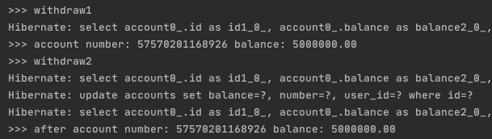

## JPA 실험실
DB 실행 환경:
- 로컬에 mysql이 설치된 후 실행되고 있어야함.
- username: root, password: 1234로 세팅해야함.
- test_db라는 논리 database를 생성해야함 
> create database test_db;

### 실험1. 영속성 컨텍스트와 Isolation level of transaction

4가지의 Isolation Level 중 Read-Committed는 다른 transaction이 commit한 결과를 볼 수 있는 격리 수준이다.
하지만 JPA를 사용하게 되면 Transaction의 Isolation을 다음과 같이 설정하여도 Repeatable-Read 수준으로 동작하는 것처럼 보이는 현상이 발생한다.

```java
@RequiredArgsConstructor
@Service
public class AccountService {

    private final AccountRepository repository;
    @PersistenceContext
    private EntityManager entityManager;

    @Transactional(isolation = Isolation.READ_COMMITTED)
    public Account findTwiceByAccountNumber(String accountNumber) {
        System.out.println(">>> withdraw1");
        Account account = repository.findByNumber(accountNumber)
                .orElseThrow(RuntimeException::new);

        System.out.println(">>> account number: " + account.getNumber() + " balance: " + account.getBalance());

        ThreadUtils.sleep(5000);

        // entityManager.clear(); // 주석 해제후 실행하면 원하는 동작을 하게됨.
        // db를 조회 후 영속성 컨텍스트에 해당 id를 가지는 Account가 존재하므로 db에서 조회한 값은 버리고 영속성 컨텍스트에 있는 entity를 사용
        Account afterAccount = repository.findByNumber(accountNumber)
                .orElseThrow(RuntimeException::new);
        System.out.println(">>> after account number: " + afterAccount.getNumber() + " balance: " + afterAccount.getBalance());

        return afterAccount;
    }

    @Transactional(isolation = Isolation.READ_COMMITTED)
    public Account withdraw2(String accountNumber, BigDecimal money) {
        System.out.println(">>> withdraw2");
        Account account = repository.findByNumber(accountNumber)
                .orElseThrow(RuntimeException::new);

        account.withdraw(money);
        return repository.save(account);
    }

    @Transactional
    public Account create(User user) {
        String newAccountNumber = RandomUtils.generateNumber();
        Account account = new Account(user, newAccountNumber, BigDecimal.ZERO);
        return repository.save(account);
    }
}
```

테스트 시나리오
```shell script
curl -X POST -H "Content-Type: application/json" -d '{"accountNumber":"57570201168926"}' "http://localhost:8080/api/v1/retrieve-twice-account" 호출 후 5초가 지나기전에
curl -X PATCH -H "Content-Type: application/json" -d '{"accountNumber":"57570201168926","money":100000}' "http://localhost:8080/api/v1/account" 를 호출한다.
```

- /api/v1/retrieve-twice-account -> findTwiceByAccountNumber(String accountNumber) 호출
- /api/v1/account -> withdraw(String accountNumber, BigDecimal money) 호출



같은 accountNumber를 바라보고 있으므로 findTwiceByAccountNumber에서는 sleep 이후에(commit 이후) 조회시 withdraw2에 의해 바뀐 금액이 조회되어야 하지만
실제로는 처음에 조회한 금액을 출력하게된다.

그 이유는 jpql과 영속성 컨텍스트가 동작하는 메커니즘 때문이다.
기본적으로 jpql로 entity의 id값이 아닌 다른 조건으로 entity를 조회할 경우 영속성 컨텍스트에서 entity를 찾지않고 db에 직접 조회한다.
그 후 영속성 컨텍스트에 해당 entity의 id를 가진 entity가 존재하면 db에서 조회해온 entity는 버리고 영속성 컨텍스트에 존재하는 entity를 사용하게된다.
spring data jpa를 이용하여 findByXXX(...)메서드를 선언하여 사용하면 jpql을 generate하여 동작 하게되기 때문에 일단 db를 조회한다. 따라서 위의 메커니즘에 적용된다.
즉, Transaction의 격리 수준을 Read-Committed 수준으로 설정을 하여도 Repeatable-Read 수준으로 동작하는 것 처럼 보이게된다.
이를 해결하면 영속성컨텍스트를 직접 clear() 한 후 조회하면 된다.

위의 상황처럼 트랜잭션 중간에 다른 트랜잭션에서 commit된 데이터를 보고싶은 경우가 흔하진 않을 것이다.
또한 Mysql의 기본 isolation level은 Repeatable-Read이기 때문에 mysql을 db로 사용시 별도로 isolation을 설정해주지 않으면 mysql의 isolation level을 따라가기 때문에 정상적인 동작이기도 하다.

하지만 isolation level을 관리해야하는 상황일 경우에 이러한 동작을 주의하면 좋을 것 같다.